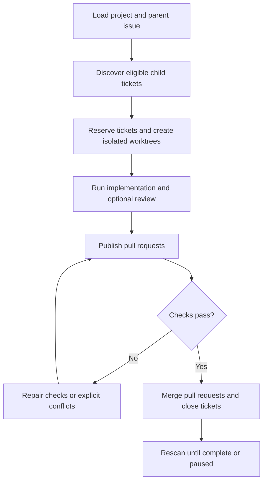

# Sandcastle Runner

Sandcastle Runner is a local CLI that takes a configured GitHub parent issue, finds eligible child tickets, runs isolated implementation and review attempts, publishes pull requests, repairs required checks or merge conflicts, and confirms ticket closure.

## Workflow



## Prerequisites and limitations

- Linux with Node.js, npm, Git, GitHub CLI (`gh`), and Codex available to Sandcastle.
- A GitHub repository checkout at an absolute path.
- A credential environment variable configured in the project file (for example, `GH_TOKEN`). Interactive `gh auth` is not used.
- The configured repository and tracker must use GitHub. The runner mutates issues, branches, worktrees, pull requests, and merges; use a test repository when experimenting.
- Runs are scoped to one project and parent issue. Missing or invalid recovery state pauses instead of guessing.

## Configuration and usage

Create a project directory with this layout:

```text
projects/<project-key>/
├── config.json
├── prompts/
│   ├── implement.md
│   ├── review.md
│   ├── ci-repair.md
│   ├── conflict-repair.md
│   └── documentation.md
└── logs/
```

Start from [`projects/trickplay-cropper`](projects/trickplay-cropper) and set the repository, absolute checkout, target branch, credential variable, agent profiles, timeouts, and workflow flags in `config.json`. Enabled workflow nodes require their prompt file; implementation and repair prompts must be non-empty. Configuration files are ordinary JSON and may contain `$comment` fields.

Install dependencies and run a parent issue:

```sh
npm ci
npm exec -- sandcastle-runner run --project <project-key> --parent <issue-number>
```

The command prints one JSON summary. `succeeded` and `no_work` exit with status 0; `incomplete`, `cancelled`, and `failed` exit non-zero.

## Local development

```sh
npm ci
npm test                 # run tests
npm run check            # format check, lint, and typecheck
npm run typecheck        # TypeScript build-time validation
npm run verify           # tests plus all checks
npm run format           # format source files
```

The test suite uses scripted tracker, code-host, Git, agent, clock, and terminal boundaries. It does not call authenticated Codex/Sandcastle services or mutate a remote GitHub repository.
