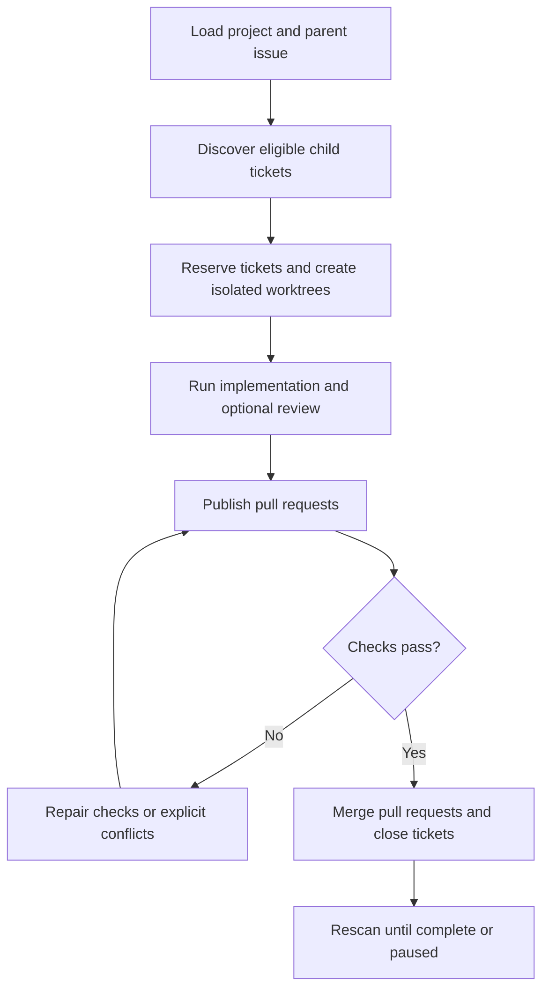

# Sandcastle Runner

Sandcastle Runner is a local CLI that takes a configured GitHub parent issue, finds eligible child tickets, runs isolated implementation and review attempts, publishes pull requests, repairs required checks or merge conflicts, and confirms ticket closure.

## Workflow



## Installation contract

Sandcastle Runner is a checkout-only CLI. Clone this repository, install its
locked dependencies, and invoke the local executable through npm:

```sh
git clone https://github.com/xiakeng/sandcastle-runner.git
cd sandcastle-runner
npm ci
npm exec -- sandcastle-runner run --project <project-key> (--parent <issue-number> | --issue <issue-number>)
```

The Runner is not published to a package registry, globally installed, invoked
through a remote `npx`, distributed as a native installer, or bundled with
Node.js, npm, Git, GitHub CLI, or Codex. Install those external prerequisites
separately for your operating system. `npm ci` and local `npm exec` are the
only supported Runner installation and invocation path.

## Prerequisites

Every host needs the following in the same terminal that runs the Runner:

- Node.js **>=22.18.0**. npm is the version bundled with Node.js; do not use a
  separate global npm to satisfy this requirement.
- Git, with `git` directly runnable on `PATH` (Git worktrees are required).
- GitHub CLI (`gh`), with `gh` directly runnable on `PATH`.
- An installed and authenticated Codex CLI, with `codex` directly runnable on
  `PATH`. OpenAI does not publish a Runner-specific Codex version floor.
- A GitHub repository checkout at an absolute path.

Missing executables fail on first use through the existing logical-command error
path. The Runner does not start an interactive `gh auth` flow.
Authenticate Codex with the [Codex CLI instructions](https://learn.chatgpt.com/docs/codex/cli)
and verify `codex login status`. If using API-key authentication, keep
`OPENAI_API_KEY` in the process environment; ChatGPT authentication uses
Codex's supported local sign-in. Neither credential belongs in `config.json`.

### macOS

Install Node.js 22.18.0 or newer from the [Node.js macOS download](https://nodejs.org/en/download), or use a maintained package manager such as Homebrew. npm is bundled with Node.js. Install Git with [Xcode Command Line Tools](https://developer.apple.com/library/archive/technotes/tn2339/_index.html), the [Git macOS installer](https://git-scm.com/install/mac), or your package manager. Install `gh` using the [GitHub CLI macOS instructions](https://github.com/cli/cli#installation), and install Codex using the [Codex CLI instructions](https://learn.chatgpt.com/docs/codex/cli).

After installation, open the terminal profile used for Runs and verify:

```sh
node --version       # must be v22.18.0 or newer
npm --version
git --version
gh --version
codex --version
codex login status
command -v node npm git gh codex
```

Set the credential variable named by both `tracker.tokenEnv` and
`codeHost.tokenEnv` in `config.json` (the template uses `GH_TOKEN`) before
starting the Run:

```sh
export GH_TOKEN='your-github-token'
```

Put the export in the shell profile only if that is appropriate for the host,
and never commit the token. Do not run `gh auth login`; the configured
environment token is passed to the non-interactive GitHub operations.

### Windows (native PowerShell)

Install Node.js 22.18.0 or newer with the [Node.js Windows installer](https://nodejs.org/en/download) or a maintained Windows package manager. npm is bundled with Node.js. Install [Git for Windows](https://git-scm.com/install/windows), `gh` from the [GitHub CLI Windows instructions](https://github.com/cli/cli#installation), and Codex using the [Codex CLI instructions](https://learn.chatgpt.com/docs/codex/cli). Reopen PowerShell after installation so the installers' `PATH` changes take effect.

Verify the commands in the PowerShell session used for Runs:

```powershell
node --version       # must be v22.18.0 or newer
npm --version
git --version
gh --version
codex --version
codex login status
Get-Command node, npm, git, gh, codex
```

Set the configured credential variable for the session, or persist it for
future sessions with the normal Windows environment-variable controls:

```powershell
$env:GH_TOKEN = 'your-github-token'
# Optional persistent setup (open a new PowerShell afterwards):
setx GH_TOKEN "your-github-token"
```

The variable name must match `tracker.tokenEnv` and `codeHost.tokenEnv` in
`config.json`. Do not run interactive `gh auth login` or commit the token.

### Linux

Install Node.js 22.18.0 or newer from the [Node.js Linux download](https://nodejs.org/en/download), or from a maintained distribution/package-manager source. npm is bundled with Node.js. Install Git from the distribution or the [Git Linux instructions](https://git-scm.com/install/linux), `gh` from the [GitHub CLI Linux instructions](https://github.com/cli/cli#installation), and Codex using the [Codex CLI instructions](https://learn.chatgpt.com/docs/codex/cli). Keep each executable on the `PATH` of the shell that starts the Runner.

Verify the commands:

```sh
node --version       # must be v22.18.0 or newer
npm --version
git --version
gh --version
codex --version
codex login status
command -v node npm git gh codex
```

Set the credential variable named in `config.json` before invoking the Runner:

```sh
export GH_TOKEN='your-github-token'
```

Use a shell profile or another local secret mechanism only when appropriate;
never commit the token. Interactive `gh auth` is not used.

These instructions describe the checkout contract on the three native OS
families. They do not promise a broader OS or tool-version matrix, permanent
cross-platform CI coverage, WSL-specific behavior, or a real Codex/Sandcastle
integration guarantee. The configured repository and tracker must use GitHub;
the Runner mutates issues, branches, worktrees, pull requests, and merges, so
use a test repository when experimenting.

## Configuration and usage

Create a project directory with this layout:

```text
projects/<project-key>/
├── config.json
├── prompts/
│   ├── implement.md
│   ├── review.md
│   ├── ci-repair.md
│   ├── conflict-repair.md
│   └── documentation.md
└── logs/
```

Start from [`projects/trickplay-cropper`](projects/trickplay-cropper) and set the repository, absolute checkout, target branch, credential variable, agent profiles, timeouts, and workflow flags in `config.json`. Enabled workflow nodes require their prompt file; implementation and repair prompts must be non-empty. Configuration files are ordinary JSON and may contain `$comment` fields.

Install dependencies and run a parent issue:

```sh
npm ci
npm exec -- sandcastle-runner run --project <project-key> (--parent <issue-number> | --issue <issue-number>)
```

The command prints one JSON summary. `succeeded` and `no_work` exit with status 0; `incomplete`, `cancelled`, and `failed` exit non-zero.

## Local development

```sh
npm ci
npm test                 # run tests
npm run check            # format check, lint, and typecheck
npm run typecheck        # TypeScript build-time validation
npm run verify           # tests plus all checks
npm run format           # format source files
```

The test suite uses scripted tracker, code-host, Git, agent, clock, and terminal boundaries. It does not call authenticated Codex/Sandcastle services or mutate a remote GitHub repository.
