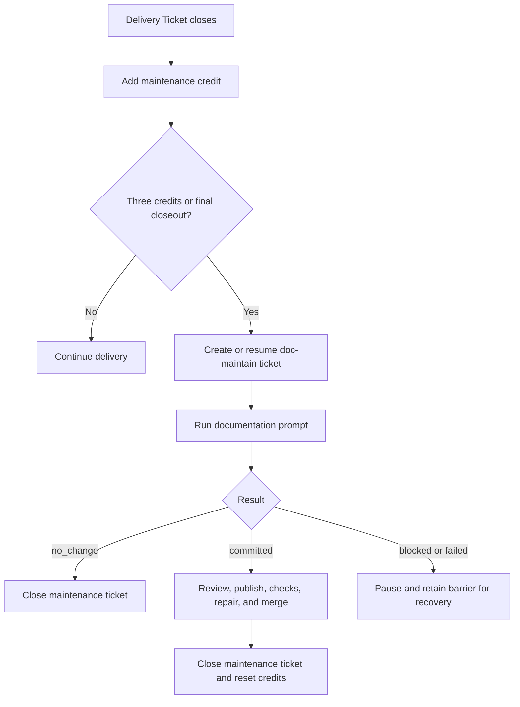
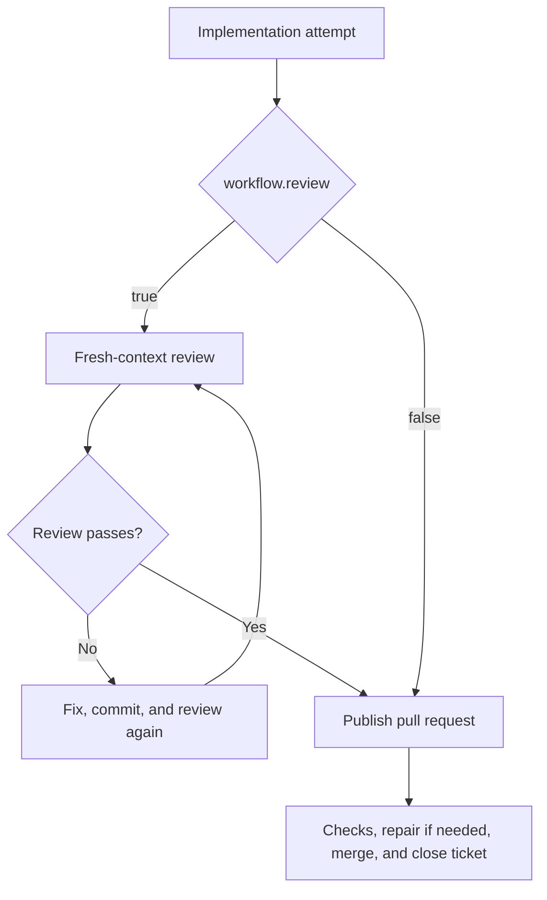

# Project Template

This directory is a project template for Sandcastle Runner. Copy it to `projects/<project-key>` and adapt `config.json` and the prompts.

## `config.json`

- `repository`: GitHub repository in `owner/name` form.
- `checkout`: absolute path to that repository.
- `targetBranch`: branch to update.
- `tracker`: GitHub settings: `tokenEnv` names the credential variable; `runnerAccount` is the bot/user; `reservationLabel` marks reserved tickets.
- `codeHost`: GitHub settings; `tokenEnv` names the credential variable and `adminMerge` controls administrative merge requests.
- `workflow.review`: enable or disable the review attempt.
- `workflow.documentationMaintenance`: enable or disable Documentation Maintenance.
- `agents`: model and reasoning effort for `implement`, `review`, `ciRepair`, `conflictRepair`, and `documentation` attempts. `review` and `documentation` are needed only when enabled.
- `timeouts`: positive minute limits for agent attempts, required checks, and merge queue confirmation.
- `ticketClosure`: `runner` or `code_host`.
- `maintenanceTicket`: title, body, and `doc-maintain` label for maintenance tickets.

Keep credentials in the environment, for example `export GH_TOKEN=...`. Both workflow switches default to `true` when omitted. `$comment` fields are ignored.

## Documentation Maintenance workflow

Each completed Delivery Ticket adds one credit. Three credits schedule one maintenance ticket; remaining credits schedule one at final closeout.



With `documentationMaintenance: false`, unfinished maintenance state is forgotten without reading or changing its ticket or artifacts; re-enabling does not rediscover it.

## Review enabled versus disabled



## Prompt placeholders

- `implement.md`: `TICKET_NUMBER` (issue number), `TICKET_REFERENCE` (authoritative issue reference), `WORKTREE_PATH` (isolated worktree), `SOURCE_BRANCH` (delivery branch), `BASE_SHA` (worktree base commit), `PROJECT_TARGET_BRANCH` (configured target branch).
- `ci-repair.md`: the implementation fields above, plus `PULL_REQUEST_NUMBER` and `PULL_REQUEST_URL` (existing pull request), and `FAILED_CHECKS` (failed required checks and links).
- `conflict-repair.md`: the same ticket, worktree, branch, and base fields, plus `PULL_REQUEST_NUMBER`, `PULL_REQUEST_URL`, `TARGET_BRANCH_SHA` (fresh target branch commit), and `MERGE_CONFLICT` (reported conflict details).
- `documentation.md`: `TICKET_NUMBER`, `TICKET_REFERENCE`, `WORKTREE_PATH`, `SOURCE_BRANCH`, and `PROJECT_TARGET_BRANCH`.
- `review.md`: `REVIEW_HANDOFF`, a JSON review context containing repository, branches, worktree, fixed point, ticket/spec snapshots, instructions, and reported checks.

## Run

From the Sandcastle Runner repository:

```sh
npm ci
npm exec -- sandcastle-runner run --project <project-key> --parent <issue-number>
```
